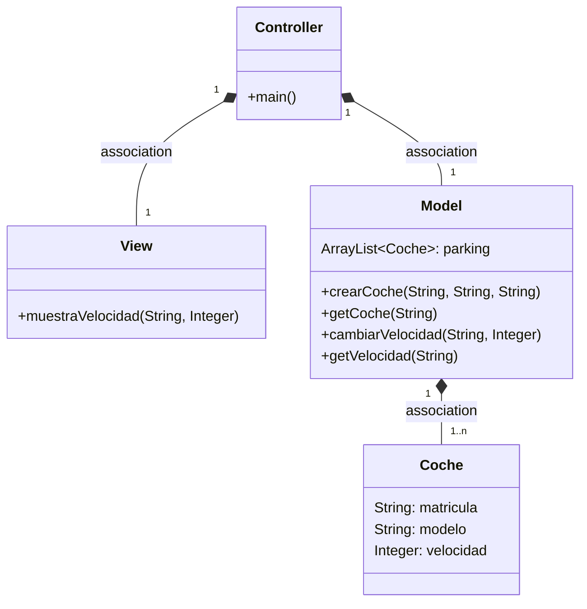
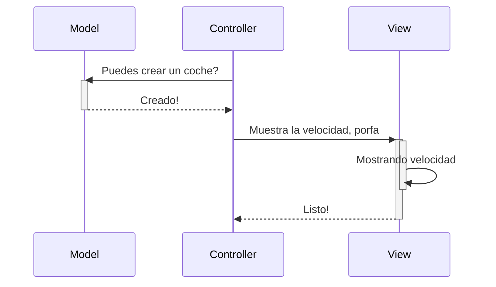
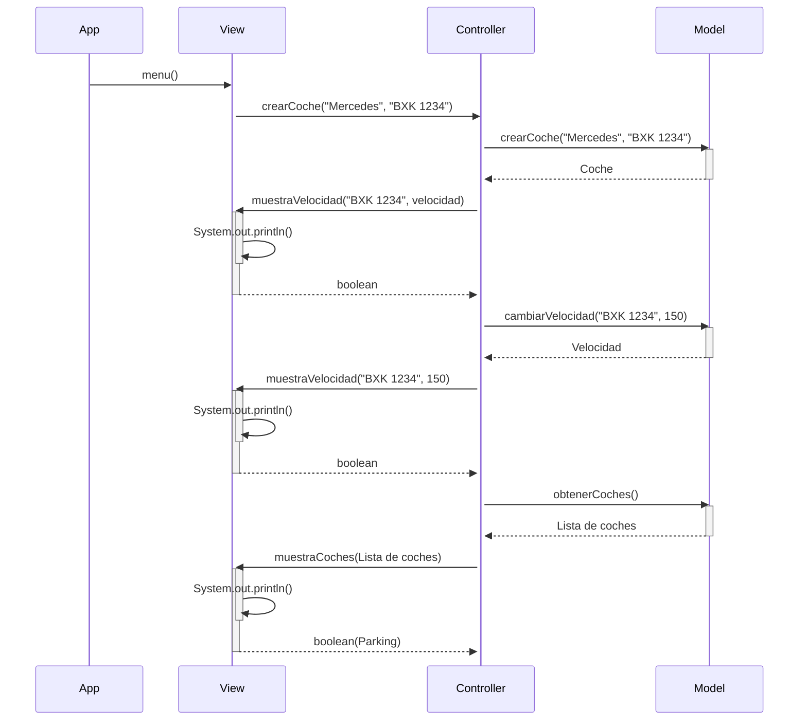
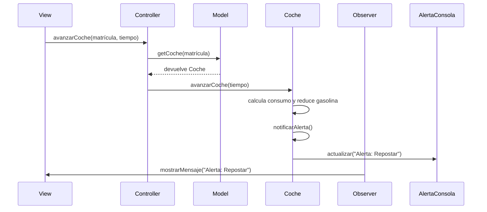

# Examen 3º TRIMESTRE

Este proyecto simula un parking de coches. Se han añadido dos nuevas funciones: **avanzarCoche** y **echarGasolina**.

---

## Implementación de `avanzarCoche`

- En la clase **`Coche`** se crea el método `avanzarCoche(int tiempo)`, que calcula la distancia con la fórmula:

- Si el coche no tiene gasolina suficiente, no avanza y devuelve `-1`.

- En la clase **`Controller`** se crean métodos para buscar el coche por matrícula y llamarlo.

- En **`View`** se añade una opción en el menú para que el usuario introduzca el tiempo y se intente avanzar el coche.

---

##  Implementación de `echarGasolina`

- En la clase **`Coche`** se añade una variable `gasolina` y el método `echarGasolina(double litros)` para sumar gasolina al coche.

- En **`Controller`** se crean métodos para buscar el coche y asignarle los litros indicados.

- En **`View`** se añade una opción al menú para introducir matrícula y cantidad de gasolina que se quiere echar.

---

### Comprobación

- Al echar gasolina, se actualiza correctamente.
- Al avanzar, si hay gasolina suficiente, recorre la distancia y se descuenta el consumo.
- Si no hay gasolina suficiente, no avanza y se muestra un mensaje.

## Implementación del patrón Observer

- Se crea una interfaz `AlertaObserver` con el método `actualizar(String mensaje)`.
- La clase `AlertaConsola` implementa esta interfaz y muestra el mensaje por pantalla. ***En el mermaind es el observer***
- La clase `Coche` registra observadores y los notifica cuando la gasolina cae por debajo de 10 litros.

### Comprobación

Lo que hacemos aquí es:
1 -> `crear un coche`
2 -> `ver los coches que hay en el parking`
3 -> `modificar la velocidad a 100km/h`

A continuación: 
1 -> `le ponemos 55 litros de gasolina al coche`
2 -> `avanzamos 4 horas (400km), el coche se queda con 15 litros`
3 -> `Vuelvo a avanzar 1 hora (100km), y me salta la alerta ya que me quedan menos de 10 litros`

# Arquitectura MVC

Aplicación que trabaja con objetos coches, modifica la velocidad y la muestra

---
## Diagrama de clases:

---

## Diagrama de Secuencia

Ejemplo básico del procedimiento, sin utilizar los nombres de los métodos

## Diagrama con los metodos y funciones de mi programa

## Diagrama de Secuencia con el observer

